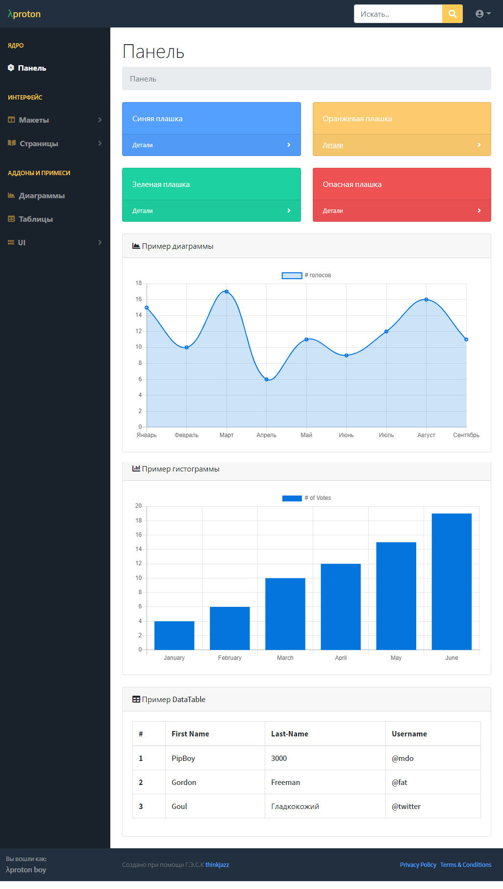
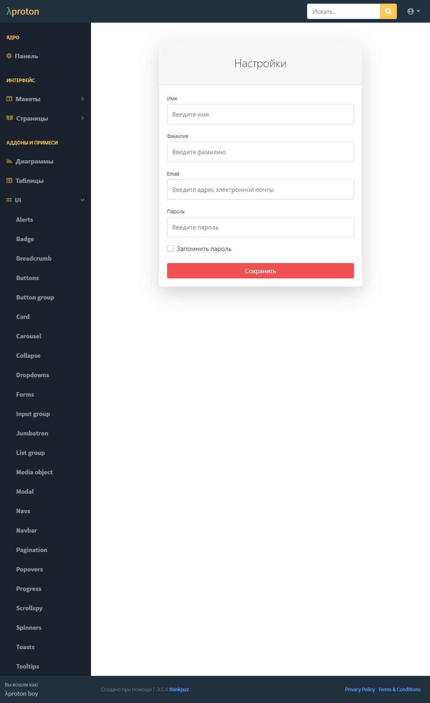
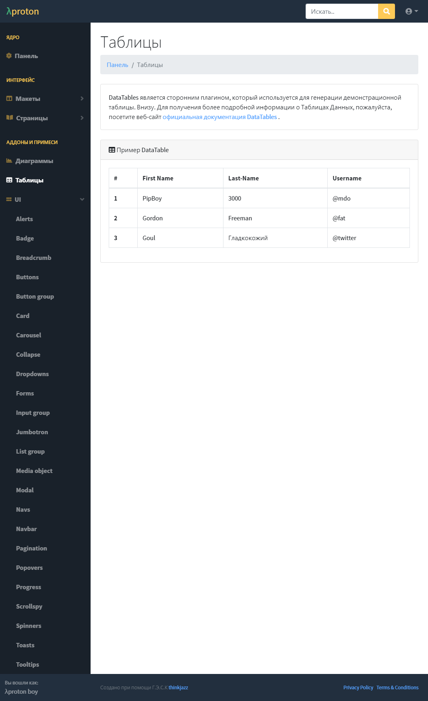
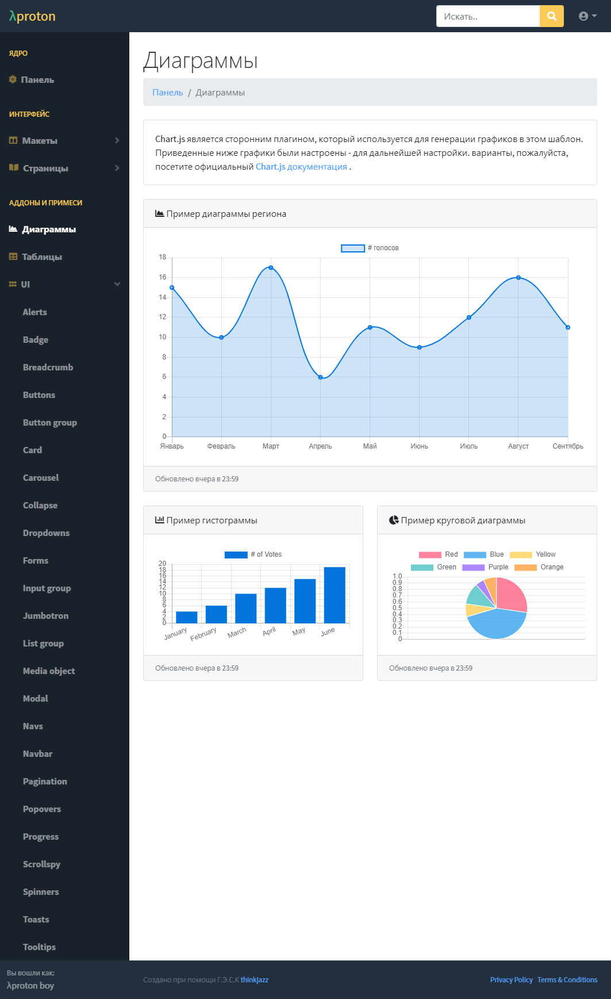

# λproton[lambda-proton]
## Панель сделана с использованием Svelte и Sapper.


## Демо 
   [Демонстрация](https://lambda-proton-k9i1lsboc.now.sh/)
## Обзор








## Начало работы


### Клонируем репозиторий

    git clone git@github.com:thinkjazz/lambda-proton.git

### Запуск проекта

Однако, получив код, можно установить зависимости и запустить проект в режиме разработки:

```bash
cd lambda-proton
npm install # or yarn
npm run dev
```

Откройте [localhost:3000](http://localhost:3000) и начни щелкать.

## Библиотека компонентов

Мы использовали SvelteStrap в качестве библиотеки компонентов.

### SvelteStrap

SvelteStrap является UI-компонентной библиотекой для Svelte. Она предоставляет множество компонентов, которые мы можем легко использовать, обратитесь к [docs](https://github.com/bestguy/sveltestrap).

## Структура

Sapper ожидает найти две директории в корне вашего проекта — `src` and `static`.

### src

Каталог [src](src) содержит точки входа для Вашего приложения - `client.js`, `server.js` и (опционально) `service-worker.js` - вместе с файлом `template.html` и каталогом `routes`.

#### src/routes

Это сердце твоего приложения "Саппер". Существует два типа маршрутов - _pages_ и _server routes_.

**Страницы** - это компоненты Svelte, написанные в `.svelte` файлах. Когда пользователь впервые посещает приложение, ему обслуживается серверная версия маршрута, а также некоторый JavaScript, который "гидратирует" страницу и инициализирует клиентский маршрутизатор. С этого момента навигация по другим страницам полностью осуществляется на клиенте для быстрого, похожего на работу приложения, ощущения. (Sapper будет предварительно загружать и кэшировать код для этих последующих страниц, так что навигация будет мгновенной).

**Маршруты сервера** - это модули, написанные в `.js` файлах, которые экспортируют функции, соответствующие методам HTTP. Каждая функция получает в качестве аргументов объекты Express ` Request` и `response`, плюс функцию `next`. Это полезно, например, для создания JSON API.

Существует три простых правила именования файлов, которые определяют ваши маршруты:

- Файл `src/routes/about.svelte` соответствует маршруту `/about`. Файл `src/routes/blog/[slug].svelte` соответствует `/blog/:slug` маршруту, в этом случае к маршруту доступен `params.slug`.
- Файл `src/routes/index.svelte` (или `src/routes/index.js`) соответствует корню вашего приложения. Файл `src/routes/about/index.svelte` обрабатывается так же, как и `src/routes/about.svelte`.
- Файлы и каталоги с ведущим подчеркиванием _not_ создают маршруты. Это позволяет вам группировать вспомогательные модули и компоненты с маршрутами, которые от них зависят - например, у вас может быть файл с именем `src/routes/_helpers/datetime.js` и он _not_ создаст маршрут `/_helpers/datetime`.

### static

Каталог [static](static) содержит все статические активы, которые должны быть доступны. Они обслуживаются с помощью [sirv](https://github.com/lukeed/sirv).

В вашем файле [service-worker.js](src/service-worker.js), вы можете импортировать их как `файлы` из сгенерированного манифеста...

```js
import { files } from '@sapper/service-worker';
```

...чтобы вы могли кэшировать их (хотя вы можете не делать этого, например, если вы не хотите кэшировать очень большие файлы).

## Конфигуратор сборщика

Sapper использует Rollup или webpack для обеспечения кодовой разбивки и динамического импорта, а также для компиляции Ваших компонентов Svelte. С webpack, он также обеспечивает горячую перезагрузку модулей. До тех пор, пока вы не сделаете ничего глупого, вы можете редактировать конфигурационные файлы, чтобы добавлять любые плагины, которые вам нравятся.

## Продакшн и развертывание

Чтобы запустить продакшн версию вашего приложения, запустите `npm run build &&npm start`. Это отключит перезагрузку в реальном времени, и активирует соответствующие плагины бандла.

Вы можете развернуть свое приложение в любой среде, поддерживающей узел 10 или выше. В качестве примера, для установки в [ZEIT Now](https://zeit.co/now) при использовании `sapper export`, выполните эти команды:

```bash
npm install -g now
now
```

Если ваше приложение не может быть экспортировано на статический сайт, вы можете использовать [now-sapper](https://github.com/thgh/now-sapper) конструктор. Инструкции о том, как это сделать, можно найти в его [README](https://github.com/thgh/now-sapper#basic-usage).
